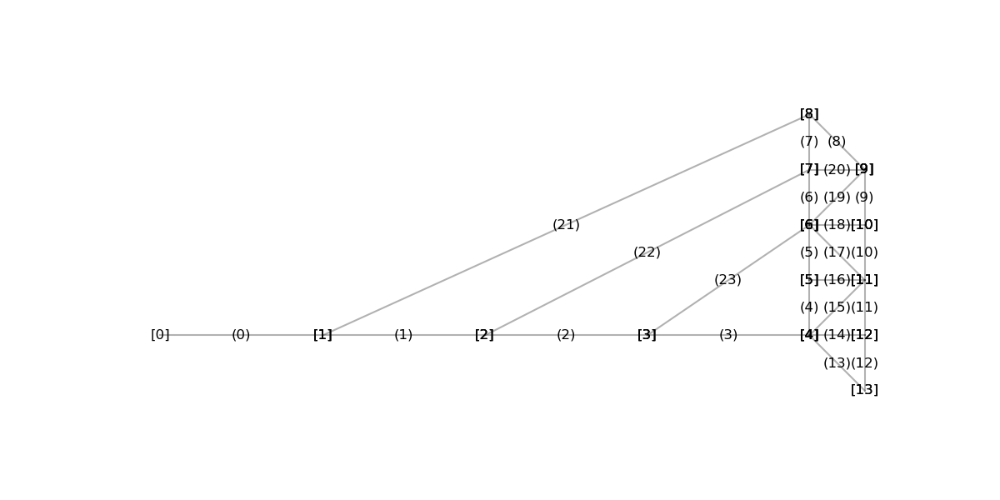
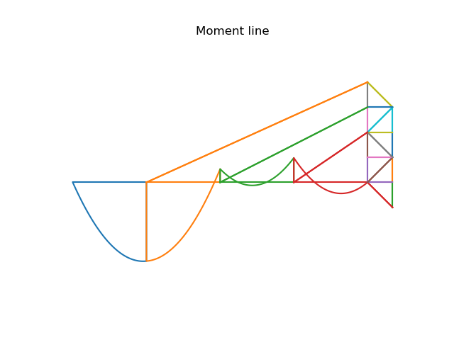

## **Question 1** : Explain what effect hinges have on the matrix method. The following questions might help you:

### Which deformations would you expect for an element with hinges on both ends?

An element with hinges on both ends can take only axial forces (tension/compression) but no moments and no shear force. The deformation of that element would be in the local direction of that element.  

###  How about an element with a hinge on one end? What would you expect for w(x)?

An element with a hinge on one end (is free to rotate) but the end can take moment which make the element carrying bending moment and shear force which leads to vertical displacement w(x) in that element. 

###  Which internal forces would you expect for an element with hinges on both ends? And how do those forces relate to forces in the global coordinate system? 

only axial forces would be present in such elements. The forces in the elements acts along the local axis of the elements. To relate these forces to forces in the global coordinate system, they must be decomposed into horizontal and vertical components in the global coordinate system. 

### How about an element with a hinge on one end? What would you expect for M(x)?

In the element (0 < $x$ < L), it would be expected to have M(x). At the end with a hinge $M$ = 0 and the other end will have $M$.

###  Which degrees-of-freedom are relevant for an element with hinges on both ends?

For an element with hinges at both ends, the axial displacement will be the only relevant Dof. No rotation because there is no moment and no vertical displacement of the element because it takes no shear force. 

###  Can you calculate the rotation of hinged nodes? And if so, what is the meaning of those rotations? Does it matter if a node is connected with a hinge to either one or all of the neighboring elements?

The rotation of a hinged nodes can be calculated if the node is connected to at least on beam element and its rotation depends on the bending behavior of that beam and it can be found using:
$$
\theta = \frac{M}{EI}
$$

If a node is connected only to truss or cable elements, rotation can not be calclated because trusses and cables do not resist bending.

###  If degrees of freedom are irrelevant, what would that mean for the size of your K-matrix? How could you solve it?

Any irrelevant degrees of freedom or a dof that constrained to zero reduces the size of the K-matrix. For example, if the first Dof is irrelevant, the first column and the first row should be removed from the K-matrix to get the reduced stiffness matrix.

###  Can you reuse the element classes derived before? If yes, which tricks do you need to make it work? Are those tricks exact and do they mimic physical behaviour? If not, what new element types do you need? How do the values in those element types correspond to each other?

Answer

### Is the stiffness matrix of an element with two hinges contained within the stiffness matrix of the full element? Is the K matrix of an element with just one hinge contained within the system matrix of the full element? If not, what are the differences?

Answer

## **Question 2**  Explain in words and math how you adapted/added code and/or procedures to solve this structure including hinges.

Answer

## **Question 3** Describe alternatives you considered for your implementation in the previous steps.

## **Question 4**  Explain why your sanity checks prove that all of your code implementations are correct.

## **Question 5** Make a table of all nodal displacement and show the displaced structure in a figure. Indicate how you identify nodes.

The resluts are showen in meter [$m$] . 
|   nodes | x-coordinate | z-coordinate   |nodal horizontal displacement|nodal vertical displacement| nodal rotation|
| :-: | :-: | :-: | :-: |:-:|:-:|
| node 0  |  0     | 0   |-0.00454575|0.1|-0.03375181|
| node 1  |  11.75 | 0   |-0.00454575|0.38454161|-0.00852495|
| node 2  |  23.5  | 0   |-0.00460226|0.31259962|0.01357086|
| node 3  |  35.25 | 0   |-0.01076561|0.16045391|0.01145538|
| node 4  |  47    | 0   |-0.02069145|0.03113487|0.01247095|
| node 5  |  47    | -4  |-0.04838331|0.03488135|0.00731792|
| node 6  |  47    | -8  |-0.08704926|0.03862782|0.00973863|
| node 7  |  47    | -12 |-0.12665653|0.03971737|0.00911702|
| node 8  |  47    | -16 |-0.16082451|0.03974533|0.00915058|
| node 9  |  51    | -12 |-0.12457761|0.00355284|0.0091875|
| node 10 |  51    | -8  |-0.0858185|0.00351639|0.00944309|
| node 11 |  51    | -4  |-0.04838331|0.00255686|0.00789464|
| node 12 |  51    | 0   |-0.02069145|0.00127843|0.00566428
| node 13 |  51    | 4   |0|0|0.00432853|

## Question 6:  Show the moment diagram of the structure in a figure.

## Question 7:  Provide a figure of a free body diagram of the full structure in which you show all the forces working on the structure (including support reactions) with numerical values from your code. This specific figure can be hand drawn.

## Question 8: Provide a figure of a free body diagram of the indicated node with numerical values from your code. This specific figure can be hand drawn. If you implement code for this in the matrixmethod package, make sure to perform sanity checks

## Question 9: Comment on any potential mistakes you observed in your final answers.

## Question 10: If you had the time to expand this Matrix Method with an additional feature, what would that be?